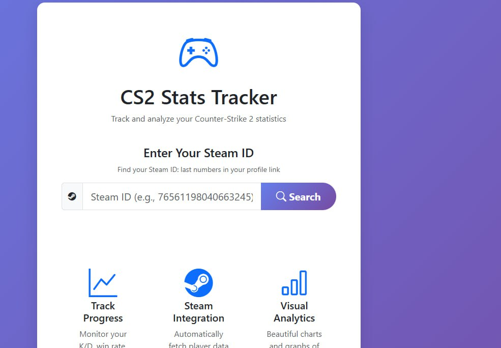
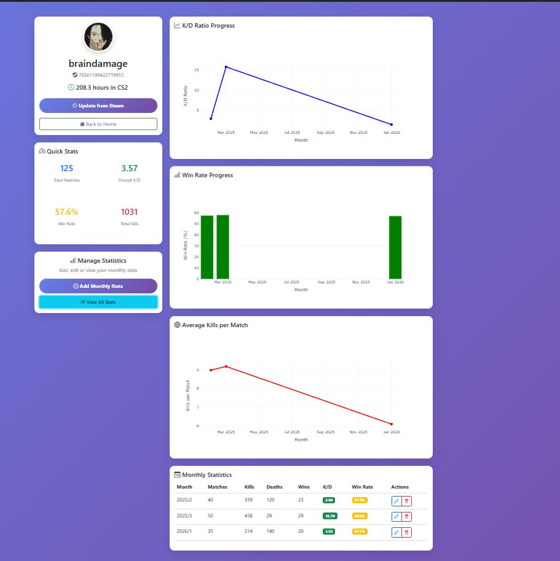
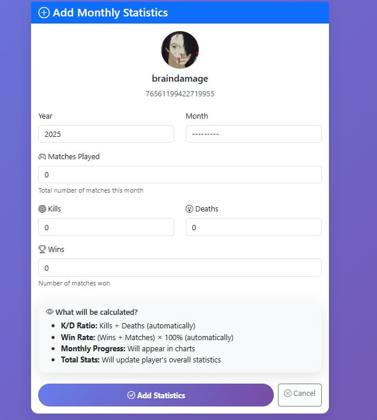
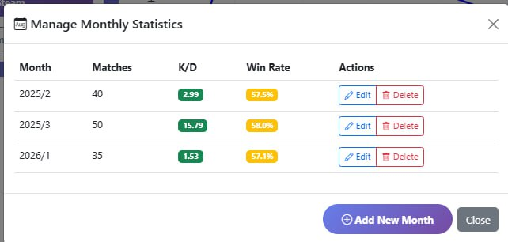

# CS2 Stats Tracker

**Веб-сервис для анализа и отслеживания статистики Counter-Strike 2.** Система берёт часы игры ,ник а также аватар пользователя прямо из стима,благодаря staem api.Пользователь можеть вставлять информацию о своих играх и таким способом мониторить свою статистику.Если у вас нет стим аккаунта можете использовать моё айди : 76561199422719955

**🚀 Рабочий проект:** https://Kolyambajkee00.pythonanywhere.com

## 📊 Ключевые возможности

- ** Поиск игроков по Steam ID** - автоматическая загрузка данных из Steam (аватар, никнейм, часы в игре)
- **Добавление месячной статистики** - ввод матчей, убийств, смертей, побед с автоматическим расчетом K/D ratio и win rate
- **Интерактивные графики** - визуализация прогресса через Plotly (динамика K/D, win rate по месяцам)
- **Адаптивный интерфейс** - мобильная верстка на Bootstrap 5
- **Автоматические расчеты** - система автоматически вычисляет все ключевые метрики

## 🛠️ Технологии

### Backend
- **Python 3.12** - основной язык разработки
- **Django 6.0** - веб-фреймворк
- **SQLite** - база данных (разработка и продакшн)

### Аналитика и визуализация
- **Pandas 2.3.3** - анализ и агрегация статистических данных
- **Plotly 6.5.1** - создание интерактивных графиков
- **NumPy 2.4.1** - математические вычисления

### Frontend
- **Bootstrap 5.3** - адаптивная верстка и компоненты
- **Bootstrap Icons** - иконки для интерфейса
- **Plotly.js** - интерактивные графики на клиенте

### Интеграции
- **Steam Web API** - получение данных об игроках
- **Requests 2.32.5** - HTTP-запросы к внешним API

### Хостинг и инструменты
- **PythonAnywhere** - бесплатный хостинг для Django-приложений
- **Git & GitHub** - контроль версий
- **python-dotenv** - управление переменными окружения

## Скриншоты

### 1. Главная страница с поиском

*Поиск игроков по Steam ID с возможностью использования тестовых данных*

### 2. Профиль игрока с графиками

*Отображение статистики игрока и интерактивных графиков прогресса*

### 3. Добавление месячной статистики

*Форма для ввода игровых показателей с автоматическим расчетом метрик*

### 4. Таблица месячной статистики

*Сводная таблица всех месяцев с K/D ratio и win rate*

##  Как запустить локально

### Предварительные требования
- Python 3.12 или выше
- Git
- Steam API ключ можно получить (бесплатно на https://steamcommunity.com/dev)

### Установка и запуск локально

#### 1. Клонирование репозитория
Откройте терминал (Command Prompt, PowerShell, или Terminal) и выполните:

```bash
# Клонируйте репозиторий
git clone https://github.com/Kolyambajkee00/cs2-yearstat-clean.git

# Перейдите в папку проекта
cd cs2-yearstat-clean
2. Создание виртуального окружения
Виртуальное окружение изолирует зависимости проекта:

bash
# Windows
python -m venv venv
venv\Scripts\activate

# Linux/Mac
python3 -m venv venv
source venv/bin/activate
Примечание: После активации виртуального окружения в начале строки терминала появится (venv).

3. Установка зависимостей
bash
# Обновите pip до последней версии
pip install --upgrade pip

# Установите все зависимости из requirements.txt
pip install -r requirements.txt
4. Настройка переменных окружения
Создайте файл .env в корне проекта (рядом с manage.py):

env
# Ключ Steam API (получите на https://steamcommunity.com/dev/apikey)
STEAM_API_KEY=ваш_steam_api_ключ_здесь

# Режим отладки (True для разработки, False для продакшена)
DEBUG=True

# Секретный ключ Django (можно оставить по умолчанию для разработки)
# DJANGO_SECRET_KEY=ваш_секретный_ключ
Важно: Файл .env уже добавлен в .gitignore и не будет загружен в репозиторий.

5. Настройка базы данных
bash
# Создайте миграции
python manage.py makemigrations

# Примените миграции к базе данных
python manage.py migrate
6. Создание администратора (опционально)
Для доступа к админ-панели Django:

bash
python manage.py createsuperuser
Введите:

Username: admin (или любой другой)

Email address: admin@example.com

Password: придумайте пароль (будет скрыт при вводе)

7. Сбор статических файлов
bash
python manage.py collectstatic
На вопрос "Type 'yes' to continue" введите yes.

8. Запуск сервера разработки
bash
python manage.py runserver
9. Открытие в браузере
Откройте браузер и перейдите по адресу:

Основной сайт: http://127.0.0.1:8000

Админ-панель: http://127.0.0.1:8000/admin

🔧 Дополнительные команды
Проверка конфигурации
bash
# Проверить настройки Django
python manage.py check

# Показать все маршруты URL
python manage.py show_urls
Тестирование Steam API
bash
# Запустить тестовый скрипт (если есть)
python manage.py shell
В оболочке Python:

python
from cs2_stats.utils.steam_api import SteamAPI
steam = SteamAPI()
# Проверка работы API
print(steam.get_player_summary("76561198040663245"))
Остановка сервера
В терминале, где работает runserver, нажмите Ctrl+C.